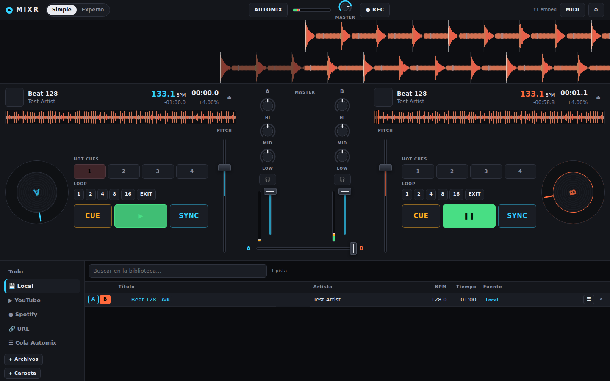

# MIXR · DJ mixer web estilo Serato

Mezclador de DJ de 2 decks que corre en el navegador. Minimalista, sin build ni dependencias: Web Audio para el motor, Web MIDI para controladores, YouTube / Spotify / URLs como fuentes externas además de tus archivos locales.



## Arrancar

```bash
cd dj-mixer
npm start            # → http://127.0.0.1:8787
```

Cualquier servidor estático sirve (`npx http-server`, `python -m http.server`), pero `npm start` además levanta el **bridge de YouTube** (ver abajo). Usá **Chrome o Edge**: son los únicos con Web MIDI y selección de salida de audio.

## Qué tiene

| Área | Funciones |
|---|---|
| Decks (A/B) | Waveform scroll en 3 bandas (graves rojo / medios verde / agudos azul), overview, beatgrid, platter con jog/nudge, Play, Cue estilo Serato, Sync (tempo + fase), pitch ±8/16/50 %, keylock, 8 hot cues, autoloops 1–16 beats, loop in/out, ½ y ×2, quantize, tap tempo, edición de BPM y de grid |
| Mixer | Trim, EQ 3 bandas con kill, filtro (LP/HP en un knob), fader con curva, crossfader equal-power o cortante, VU por canal y master, limitador en master, cue por canal a auriculares (segunda salida o **split cue** por cable Y) |
| Biblioteca | Archivos y carpetas locales (drag & drop), tags ID3 y carátula, análisis automático de BPM/beatgrid/ganancia, búsqueda, cola Automix, hot cues y BPM persistentes por pista |
| Fuentes externas | **YouTube** (link o búsqueda), **Spotify** (búsqueda + reproducción), **URL directa** (mp3, streams, radios) |
| Automático | **Automix**: encadena la cola con sync y crossfade automático. Auto-gain al cargar. En modo simple, sync automático al cargar |
| MIDI | Cualquier controlador: *MIDI learn* desde la pantalla o desde la tabla de acciones, jog relativo, LEDs de estado, exportar/importar mapa |
| Extras | Grabación del master a archivo, atajos de teclado, salidas de audio seleccionables |

## Modo simple vs. experto

- **Simple**: lo justo para mezclar. EQ, 4 hot cues, autoloops, Play/Cue/Sync grandes. Quantize siempre activo, sync automático al cargar, auto-gain. Pensado para arrancar ya.
- **Experto**: agrega trim, filtro, 8 hot cues, loop in/out/½/×2, keylock, rango de pitch, quantize conmutable, ajuste de beatgrid y zoom de waveform. Todo manual.

El modo se recuerda entre sesiones.

## Fuentes externas: qué se puede y qué no

| Fuente | Cómo | Waveform / EQ / loops precisos | Notas |
|---|---|---|---|
| Local | `+ Archivos`, `+ Carpeta` o arrastrar | ✅ | mp3, m4a, flac, wav, ogg, opus… |
| YouTube **con bridge** | `npm start` + [yt-dlp](https://github.com/yt-dlp/yt-dlp) instalado | ✅ | El servidor descarga el audio y el deck lo trata como archivo local. Habilita la búsqueda desde la app |
| YouTube **embed** (sin bridge) | Pegar link | ❌ (barra de progreso, sin EQ) | Usa el reproductor oficial; play/pause/seek/volumen/velocidad. El video se ve en el lugar del platter |
| Spotify **con bridge** | Client ID + Premium + yt-dlp | ✅ | Spotify es el catálogo (búsqueda, playlists, álbumes); el audio se busca automáticamente en YouTube por artista/título/duración y se carga como archivo. Dos decks, EQ, loops, keylock |
| Spotify **sin bridge** | Client ID propio + cuenta Premium | ❌ (DRM) | Web Playback SDK: play/pause/seek/volumen. Un solo deck a la vez |
| URL directa | Pegar URL | ✅ si el servidor permite CORS, si no ❌ | Streams/radios funcionan como `<audio>` |

Los decks "embed" y el reproductor oficial de Spotify no pasan por el motor de audio: el fader, crossfader y master sí los controlan (por volumen), pero no hay EQ, filtro, cue a auriculares ni grabación de esa señal. Es una limitación del DRM/iframe, no de la app; por eso existe el bridge.

### Bridge de YouTube

```bash
pip install yt-dlp     # o brew install yt-dlp, etc.
cd dj-mixer && npm start
```

Si `yt-dlp` está en el PATH, el estado arriba a la derecha dice **Bridge YT ✓** y en la pestaña YouTube podés buscar por texto. Podés correr el bridge en otra máquina y poner su URL en Ajustes.

### Spotify

1. Creá una app en <https://developer.spotify.com/dashboard> y agregá como Redirect URI la que muestra Ajustes: `http://127.0.0.1:8787/`. Spotify rechaza `localhost` y cualquier `http://` que no sea la IP de loopback; en un servidor remoto necesitás HTTPS. Si abriste la app en `localhost`, al conectar salta sola a `127.0.0.1`.
2. Pegá el Client ID en Ajustes → pestaña Spotify → **Conectar Spotify**.
3. Buscá temas o importá una playlist/álbum pegando su link. Requiere Premium (restricción de Spotify).

Con el bridge activo, al cargar un tema de Spotify la app busca el mismo tema en YouTube (`/api/match`: artista + título, duración a ±3 s, evita lives/covers/sped-up) y lo carga con audio real. La coincidencia se guarda por tema. Si no encuentra nada, cae al reproductor oficial. Podés desactivarlo en Ajustes para usar siempre el reproductor de Spotify.

## Controlador MIDI

1. Conectá el controlador y abrí **MIDI** (arriba a la derecha).
2. **Aprender desde pantalla**: tocá un control en la app (play, un knob, el crossfader…) y mové el control físico. Listo.
3. O usá **Learn** al lado de cada acción en la tabla (jog relativo, scroll de biblioteca, cargar selección, etc.).

El mapa se guarda en el navegador y se puede exportar/importar como JSON. Los botones con nota MIDI reciben LED de estado (play, hot cues, loops, keylock).

## Auriculares (cue)

Ajustes → **Detectar dispositivos** → elegí la interfaz/salida para *auriculares* y otra para *master*. Sin segunda salida, activá **Split cue**: canal izquierdo = cue, derecho = master (con un cable Y).

## Atajos de teclado

| Deck A | Deck B | Acción |
|---|---|---|
| `W` | `P` | Play / pausa |
| `Q` | `O` | Cue (mantener para escuchar) |
| `E` | `[` | Sync |
| `R` | `]` | Autoloop 4 beats |
| `1`–`4` | `7`–`0` | Hot cues 1–4 |
| `A` | `B` | Cargar la pista seleccionada |

`Z` / `X` mueven el crossfader, `C` lo centra, `F` enfoca la búsqueda, `↑ ↓ Enter` navegan la biblioteca. Doble click en una pista la carga en el deck libre. Click sobre el BPM = tap tempo; doble click = editar. Shift+click en un hot cue lo borra. Doble click en cualquier knob/fader lo resetea; Shift al arrastrar = ajuste fino.

## Estructura

```
dj-mixer/
├── index.html, css/style.css
├── js/main.js              wiring, modos, MIDI actions, ajustes, atajos
├── js/audio/engine.js      master, limitador, cue bus, split cue, grabación, Channel (EQ/filtro/fader)
├── js/audio/deck.js        Deck + backends (buffer, <audio>)
├── js/audio/analysis.js    waveform 3 bandas, BPM, beatgrid, ganancia
├── js/audio/keylock-worklet.js
├── js/sources/youtube.js   backend IFrame API
├── js/sources/spotify.js   PKCE + Web Playback SDK
├── js/sources/bridge.js    cliente del bridge yt-dlp
├── js/library.js, js/id3.js, js/midi.js, js/automix.js
├── js/ui/                  components (knob/fader/button), waveform, deckview, mixerview, libraryview
└── server/serve.js         estático + /api/resolve, /api/search, /api/stream (yt-dlp)
```

Sin frameworks ni bundler: módulos ES nativos. `npm run check` valida la sintaxis de todos los archivos.
